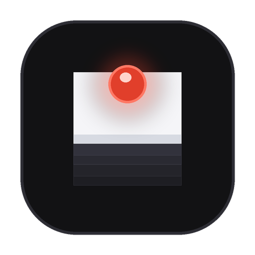

<p align="center">
  
</p>

<h1 align="center">Modula</h1>

<p align="center">
  <strong>Minimalist Canvas LMS module manager, offline downloader, and real-time auto-sync hub.</strong>
</p>

<p align="center">
  <a href="#-direct-downloads"></a>
  <a href="https://github.com/MananDua28/Modula/releases/latest"></a>
  <a href="#-privacy--security"></a>
  <a href="LICENSE"></a>
</p>

---

## ⚡ Overview

**Modula** is a distraction-free, high-performance desktop application designed for students and researchers. Connect your university Canvas LMS account with your personal access token to browse, download, and automatically synchronize course modules, lecture slides, assignments, and study materials offline.

Built with a strict Swiss-inspired aesthetic: pure obsidian black, clean white, and the signature Canvas scarlet red.

---

## 📥 Direct Downloads

Download the latest version of Modula for your operating system:

| Operating System | Download Link | Format | Architecture |
| :--- | :--- | :--- | :--- |
| **macOS** | [📥 **Download Modula for macOS (.dmg)**](https://github.com/MananDua28/Modula/releases/download/v1.0.3/Modula-1.0.3-arm64.dmg) | `.dmg` Package (114 MB) | Apple Silicon & Intel |
| **Windows (Setup)** | [📥 **Download Modula Setup Installer (.exe)**](https://github.com/MananDua28/Modula/releases/download/v1.0.3/Modula-Setup-1.0.3.exe) | `.exe` NSIS Installer (97.7 MB) | 64-bit x64 (Windows 10 / 11) |
| **Windows (Portable)** | [📥 **Download Modula Portable (.exe)**](https://github.com/MananDua28/Modula/releases/download/v1.0.3/Modula-Portable-1.0.3.exe) | `.exe` Standalone (97.4 MB) | 64-bit x64 (No install required) |
| **All Releases** | [View GitHub Releases Archive](https://github.com/MananDua28/Modula/releases) | `.zip`, `.exe`, `.dmg` | All Platforms |

> [!TIP]
> **Windows Defender SmartScreen First Launch:**  
> Because Modula is an independent open-source tool without a corporate certificate, Windows 10/11 may display *"Windows protected your PC"*.  
> Simply click **More info** &rarr; **Run anyway**.

> [!TIP]
> **macOS Gatekeeper First-Time Launch:**  
> Since Modula is an independent student project built without an Apple Developer certificate ($99/yr), macOS may display *"Modula is damaged and can't be opened"* on your first launch.  
> To approve and run it in 3 seconds, simply open Terminal and run:
> ```bash
> xattr -cr /Applications/Modula.app
> ```
> Or right-click `Modula.app` in Finder, hold the `Option` key on your keyboard, and click **Open**.

---

## ✨ Key Features

- **🔄 Background Auto-Sync & Change Detection:**
  - Automatically polls Canvas in the background (configurable from 5 min to 1 hr).
  - Instantly alerts you with a vibrant **NEW** badge when instructors upload new lecture slides or create new modules.
  - Optional **"Auto-Download New Items"** switch saves newly published materials directly to your disk.

- **📁 Granular & Bulk Downloads:**
  - **One-Click Course Download:** Download all modules, lecture slides, and notes for an entire semester with a single click.
  - **Module Accordion:** Expand any module dropdown to preview item titles, file sizes, and due dates.
  - **Selective Download:** Download individual PDFs, lab sheets, or assignment briefs on demand.

- **📑 Offline Assignment Templates & Rubrics:**
  - Automatically scans assignment descriptions for attached template files (e.g. Word documents, PDF briefs, LaTeX templates) and downloads them straight into your local assignment folders.

- **🎨 Minimalist 3-Color Design & Instant Themes:**
  - Distraction-free typography, instant toggle between **Dark Mode** (system default) and **Light Mode**.
  - Built-in update checker alerts you whenever a new release is available.

---

## 🔑 Quick Setup (How to Connect Your Canvas)

1. Log in to your university Canvas web portal (e.g. `https://canvas.bham.ac.uk`).
2. Click your **Profile Picture / Account** on the top-left sidebar $\rightarrow$ select **Settings**.
3. Scroll down to the **Approved Integrations** section.
4. Click **+ New Access Token**.
5. Set the purpose as `Modula` and click **Generate Token**.
6. Copy the generated token string.
7. Open **Modula**, paste your institution URL and token in **Settings**, and click **Save & Connect**!

---

## 📂 Local Directory Organization

Modula organizes your downloaded course materials automatically:

```
~/Downloads/Modula/
└── [Course Code] - [Course Name]/
    ├── 01_ABOUT YOUR MODULE/
    │   ├── Welcome to Engineering Projects.pdf
    │   └── Module Syllabus.pdf
    ├── 02_Week 1 - Introduction/
    │   ├── Lecture 1 - Slides.pdf
    │   └── Lab 1 - Instructions.pdf
    └── Assignments/
        ├── Preliminary Report/
        │   ├── Brief.pdf
        │   └── Report_Template.docx
        └── Final Presentation/
```

---

## 🔒 Privacy & Security Guarantee

- **100% Client-Side:** Modula runs exclusively on your local computer.
- **Direct Connection:** Your Canvas API token and university credentials communicate directly with your institution's official Canvas API endpoints.
- **Zero Third-Party Servers:** Your tokens, passwords, and course files are never collected, logged, or transmitted to any external server.

---

<p align="center">
  <sub>Modula · Designed for Students · Built with Precision</sub>
</p>